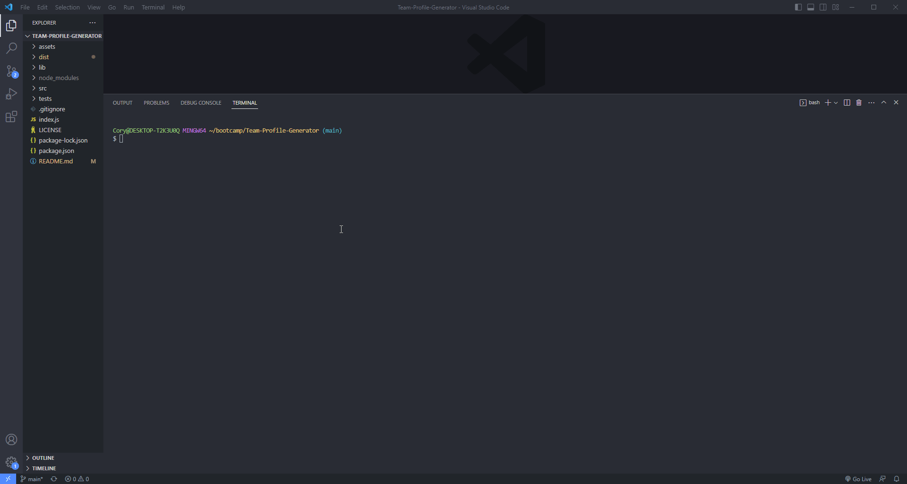

# Team Profile Generator
## Created By
   - 
   - Cory 
   - @MacaroniKetchup, 
## Table of Contents
  - [Description](#description)
  - [Installations](#installations)
  - [Usage](#usage)
  - [Contact-Info](#contact)
  - [Contributions](#contributions)
  - [Testing](#testing)
  
* [License](#license)

## Description
Team Profile Generator that displays a team profile via node.js terminal prompts with the use of inquirer as well as OOP  and saves data to display into a html file
## Demo Video

## Installations
Inquirer Ver. 8.2.4 or later , & Jest
## Usage
Besure to "npm i" in the terminal to install jest as well as "npm i inquirer" to install inquirer. Once those steps are done type "node index" into the terminal and follow the prompts displayed in the terminal once you've added all the employees needed, select the option "No more to add to the team" once you select that option a Generated HTML with your data entered through the prompts will be located in the "dist" folder once you locate the "ourteam.html" file you can right click and open the file via live server or in default browser to view the results!
## Contributors
N/A
## Contact-Info
- Name: Cory
- Email: stylesthestyer@gmail.com
- Github: [MacaroniKetchup](https://github.com/MacaroniKetchup/)
## Testing
```
Tests are located in the tests folder. If you wish to run them, in your terminal type "npm run test" then the tests will run and results will be deisplayed in a log in the terminal!
```
## License

      licensed under the MIT license.